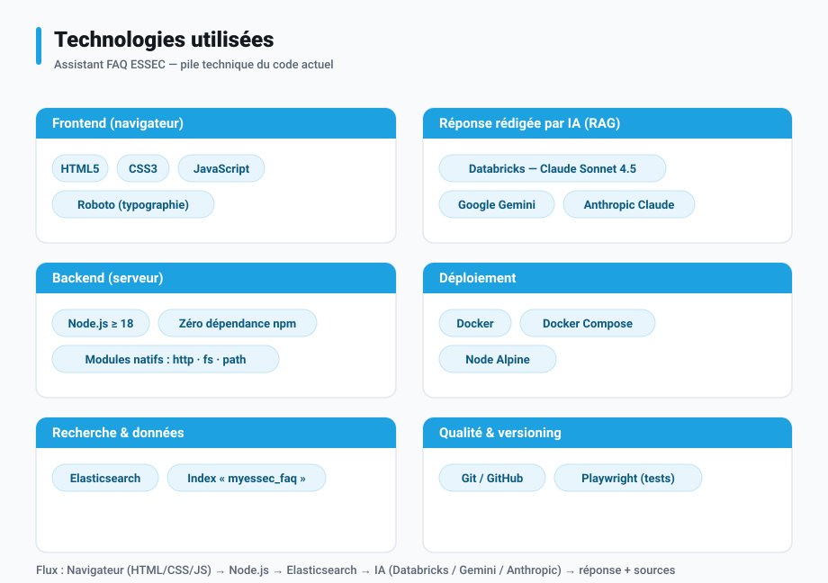

# Architecture — Assistant FAQ ESSEC

## Technologies utilisées



*Frontend en HTML / CSS / JavaScript (police Roboto) ; backend Node.js ≥ 18 sans
aucune dépendance externe (modules natifs uniquement) ; recherche dans
Elasticsearch (index `myessec_faq`) ; réponse rédigée par une IA au choix
(Databricks / Claude Sonnet 4.5, Google Gemini ou Anthropic Claude) ; mise en
boîte avec Docker et Docker Compose (image Node Alpine) ; versioning Git / GitHub
et tests automatisés avec Playwright.*

---

> Ce document explique **comment** l'application est construite et **comment
> l'information circule**, en langage courant. Il ne contient pas de code.
> Vocabulaire de base : « le serveur » = le programme qui tourne en coulisse ;
> « le navigateur » = la page web que voit l'étudiant ; « l'IA » = le modèle qui
> rédige la réponse ; « la FAQ » = la base de questions/réponses officielle,
> rangée dans un moteur de recherche appelé Elasticsearch.

> **Comment lire ce document**
> - Le **corps du document** répond à votre demande : entrée, données et
>   contexte, modèle et outils, sortie, validation humaine, puis chaque fichier
>   et ce qu'il décide.
> - L'encadré final **« 💡 Recommandations de Claude »** regroupe mes
>   observations et suggestions personnelles, **que vous n'avez pas demandées**.

## Vue d'ensemble : le trajet d'une question

```
   Étudiant (navigateur)
        │  1. « Comment obtenir mon certificat ? »
        ▼
   Serveur (server.js)
        │  2. cherche dans la FAQ (Elasticsearch)
        │  3. reclasse les articles (titre + gras d'abord)
        │  4. demande à l'IA de rédiger UNIQUEMENT à partir de ces articles
        │  5. ne garde la réponse que si l'IA se juge fiable (note ≥ 3)
        ▼
   Étudiant (navigateur)
        6. réponse rédigée + jusqu'à 3 articles sources
```

Si aucune IA n'est configurée, l'étape 4 est remplacée par une **synthèse sans
IA** (assemblage des phrases de l'article le plus pertinent).

---

## Entrée

Ce qui déclenche le traitement, c'est **une question tapée par l'étudiant** dans
le champ de la page, puis envoyée (touche Entrée ou bouton). Le navigateur
transmet cette question au serveur.

Contrôles à l'entrée : la question ne doit pas être vide et ne doit pas dépasser
**500 caractères**. Au-delà, elle est refusée avec un message.

## Données et contexte

Pour répondre, le serveur ne s'appuie **que** sur la FAQ officielle ESSEC, rangée
dans **Elasticsearch** (par défaut l'index `myessec_faq`). Chaque article y
comporte un titre, un contenu (en HTML), une adresse web (le lien officiel) et
une ou plusieurs catégories.

Avant d'être utilisés, les articles sont **nettoyés** : suppression des balises
HTML, décodage des caractères spéciaux (accents, symboles), et retrait
systématique de la mention « Last update / Dernière mise à jour » en tête.

Le **contexte** fourni à l'IA est strictement limité à une poignée d'articles
retenus (les meilleurs après reclassement, tronqués à 1 500 caractères chacun).
L'IA n'a accès à aucune autre connaissance : c'est ce qui garantit que la réponse
reste ancrée dans la FAQ.

## Modèle et outils

- **Moteur de recherche** : Elasticsearch. La recherche privilégie le titre
  (poids ×3) puis le contenu, avec tolérance aux fautes de frappe.
- **Reclassement « maison »** : après la recherche, le serveur recalcule un score
  qui favorise les articles dont le **titre** et les **passages en gras**
  contiennent les mots de la question. C'est ce reclassement, et non le score
  brut d'Elasticsearch, qui décide de l'ordre final.
- **Intelligence artificielle (facultative)** : un seul fournisseur est utilisé,
  choisi automatiquement par ordre de priorité — **Databricks** (endpoint interne
  ESSEC, Claude Sonnet 4.5), puis **Gemini** (Google), puis **Anthropic** (Claude
  en direct). Tous reçoivent exactement les mêmes consignes.
- **Consignes données à l'IA** : rédiger en français, uniquement à partir des
  extraits, en 4 étapes — comprendre l'intention, rédiger, relire et sourcer
  chaque affirmation, puis s'auto-noter de 1 à 5. La sortie attendue est un objet
  structuré : réponse trouvée ou non, note, texte, numéros des articles cités.
- **Repli sans IA** : si aucune IA n'est disponible, un algorithme simple
  sélectionne dans le meilleur article les phrases qui recoupent le plus la
  question.
- **Socle technique** : le serveur est écrit en Node.js **sans aucune
  bibliothèque externe** (uniquement les modules fournis avec Node). Rien à
  installer. Un `Dockerfile` et un `docker-compose.yml` permettent aussi de le
  lancer en conteneur.

## Sortie

Le serveur renvoie au navigateur : la **réponse rédigée** (ou le message
« Information non trouvée »), le **mode** utilisé (IA ou synthèse), et la liste
des **articles sources** (au plus 3, chacun avec titre, extrait, catégories et
lien). Le navigateur met tout cela en forme : la réponse dans une carte, les
sources sous forme de liens cliquables.

Un point d'accès technique séparé, `/api/health`, renvoie l'état du serveur
(configuré ou non, fournisseur d'IA actif, modèle, nombre de sources).

## Validation humaine

Deux garde-fous automatiques remplacent une relecture humaine à chaque réponse :

1. **L'auto-note de l'IA** : la réponse n'est montrée que si l'IA s'attribue au
   moins 3 sur 5, et seulement si elle cite au moins un article. Sinon,
   « Information non trouvée ».
2. **Le refus en cas de doute** : une panne de l'IA ou une base injoignable ne
   produit jamais de réponse « inventée » ; l'application préfère signaler qu'elle
   n'a pas trouvé.

En revanche, il n'y a **pas de validation humaine en direct** (personne ne relit
les réponses avant affichage) ni de mécanisme de retour/correction intégré. La
supervision humaine se situe en amont : le choix des accès, la qualité de la FAQ
indexée, et les réglages (seuil de note, nombre de sources).

---

## Chaque fichier, et ce qu'il décide

### `server.js` — le cerveau (côté serveur)
C'est le fichier central. Il **décide de tout le traitement** : lire la
configuration, interroger Elasticsearch, reclasser les articles, appeler (ou non)
l'IA, appliquer le garde-fou de la note, choisir les sources à afficher, et
renvoyer le résultat. C'est aussi lui qui **choisit le fournisseur d'IA** selon
l'ordre de priorité et qui **sert la page web** et le point `/api/health`.

### `public/index.html` — la page vue par l'étudiant (côté navigateur)
Contient toute l'interface (structure, style aux couleurs ESSEC, et le petit
programme qui tourne dans le navigateur). Il **décide de l'affichage** : envoyer
la question au serveur, montrer l'animation de chargement, mettre en forme la
réponse et les sources, gérer les suggestions cliquables et les messages
d'erreur. Il ne prend **aucune** décision sur le contenu de la réponse.

### `public/logo-essec.svg` — le logo officiel
Image vectorielle du logo ESSEC affichée dans le bandeau. Aucun rôle logique.

### `.env.example` — le modèle de configuration
Fichier d'exemple listant les réglages à renseigner (accès Elasticsearch, accès
IA, nombre de sources, seuils…). On le recopie en `.env` et on y met les vraies
valeurs. Il **décide, une fois rempli, du comportement** : quelle base, quelle
IA, combien de sources, quel seuil de qualité.

### `.env` (non versionné) — la vraie configuration
Créé par l'exploitant à partir de l'exemple. Contient les **vraies clés**. Il
n'est **jamais** envoyé sur Git (protégé par `.gitignore`). C'est lui que lit le
serveur au démarrage.

### `test-rag.mjs` — le banc d'essai
Programme de test autonome. Il **décide de valider** toute la chaîne sans les
vrais services : il simule un faux Elasticsearch, un faux Gemini et un faux
Databricks, envoie des questions pièges et vérifie que l'application se comporte
bien (bonne réponse, refus honnête quand il faut, gestion des pannes, mode sans
IA). Il ne fait pas partie de l'application en production.

### `README.md` — la notice
Explique en quoi consiste le projet et comment le lancer. *(Voir mes
observations sur son décalage avec le code dans l'encadré « 💡 Recommandations de
Claude » en fin de document.)*

### `Dockerfile` et `docker-compose.yml` — la mise en boîte
Décrivent comment empaqueter et lancer l'application dans un conteneur Docker.
Ils **décident de l'environnement d'exécution** (image Node, port, variables,
vérification de santé). *(Voir mes observations sur les variables transmises
dans l'encadré « 💡 Recommandations de Claude » en fin de document.)*

### `.dockerignore` / `.gitignore` — les listes d'exclusion
Indiquent ce qu'il ne faut pas copier dans l'image Docker, respectivement ce
qu'il ne faut pas envoyer sur Git (notamment le fichier `.env` et ses secrets).

### `package.json` — la fiche d'identité du projet
Nom, version, commandes de démarrage (`npm start`), version de Node requise
(≥ 18). Confirme l'absence de dépendances externes.

---

> ## 💡 Recommandations de Claude (non demandées)
>
> *Cette section n'a pas été demandée. Ce sont des **incohérences que j'ai
> relevées** dans le projet et les **corrections que je suggère**, à prendre ou à
> laisser. Elles n'empêchent pas l'application de fonctionner en local avec
> Databricks, mais peuvent surprendre. Les mêmes points sont repris, côté action,
> dans l'encadré de recommandations de `tasks.md`.*
>
> **Constats (faits observés dans le code) :**
> - **La notice (`README.md`) est en retard sur le code** : elle ne parle que
>   d'Anthropic, alors que le code gère en priorité Databricks, puis Gemini, puis
>   Anthropic. Elle ne mentionne ni Databricks, ni Gemini, ni les réglages
>   `SCORE_MIN` et `SYNTH_MIN_COVERAGE`.
> - **Le déploiement Docker ne connaît pas Databricks** : `docker-compose.yml` ne
>   transmet que les variables `ANTHROPIC_*`. Lancée ainsi, l'application en
>   conteneur **n'utiliserait pas** Databricks ni Gemini et retomberait sur
>   Anthropic (ou sur le mode sans IA). En local hors Docker, Databricks
>   fonctionne.
> - **Le fichier d'exemple (`.env.example`) ne liste pas Gemini ni Anthropic** :
>   ces fournisseurs existent dans le code comme solutions de repli, mais ne sont
>   pas documentés dans l'exemple, qui présente Databricks comme la voie unique.
> - **Modèle Anthropic par défaut différent** selon l'endroit : `claude-sonnet-5`
>   dans le code, `claude-3-5-haiku-latest` dans `docker-compose.yml`.
> - **Le parcours Anthropic n'est pas testé directement** : le banc d'essai couvre
>   Gemini, Databricks et le mode sans IA, mais pas l'appel Anthropic réel.
>
> **Ce que je suggère :** aligner `README.md`, `docker-compose.yml` et
> `.env.example` sur le code (priorité Databricks), uniformiser le modèle
> Anthropic par défaut, et vérifier les noms de modèles auprès des fournisseurs.
